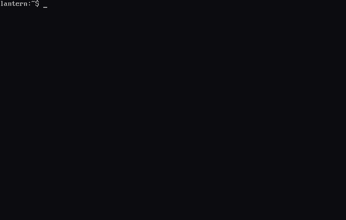
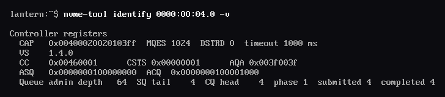
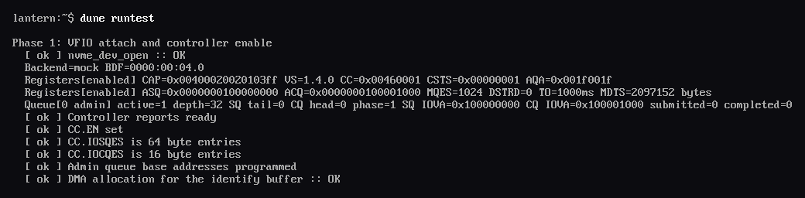
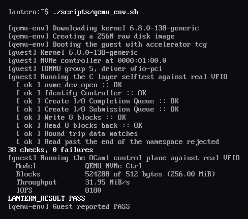
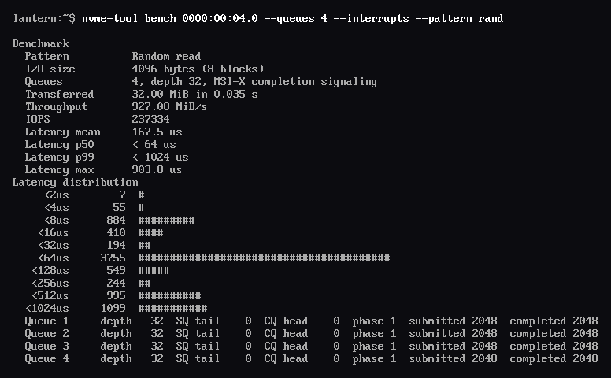

  

Userspace NVMe driver that takes a PCI function away from the kernel through `vfio-pci`, maps the controller's BAR0 register window and a pool of DMA-able buffers into a process, and then drives the device entirely by hand from there. The kernel keeps only two responsibilities under this arrangement, namely handing over the container, group and device file descriptors, and programming the IOMMU so that every address the controller is told to fetch resolves back to a page the process genuinely owns.

## Controller

The enable sequence begins by reading the capability register, because `CAP.MQES` bounds how deep any queue may be, `CAP.DSTRD` sets the stride between doorbell registers, `CAP.TO` gives the ready timeout in five hundred millisecond units, and `CAP.MPSMIN` decides whether the host page size is usable at all. With those values in hand the driver clears `CC.EN` and spins until `CSTS.RDY` falls, programs the admin queue sizes into `AQA` as zero-based values, writes the queue addresses into `ASQ` and `ACQ`, and only then sets `CC.EN` with an `IOSQES` of six and an `IOCQES` of four.

  

## Boundary

  

## QEMU guest

  

## Interrupts

  

